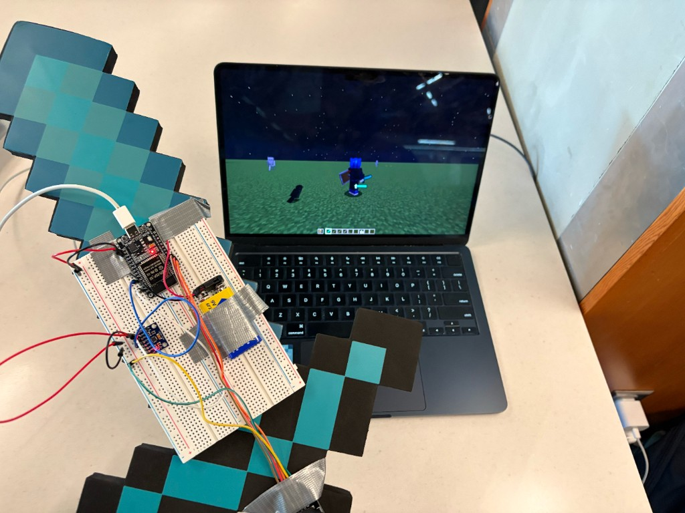
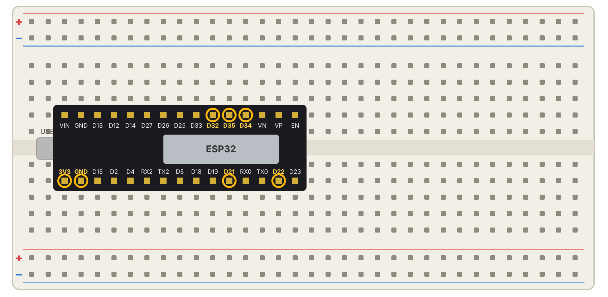
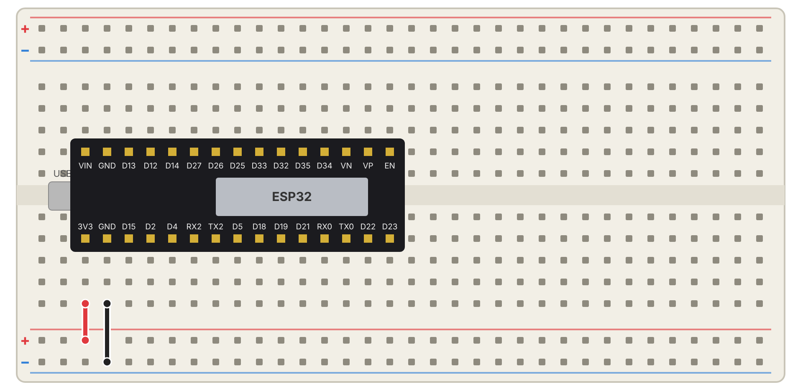
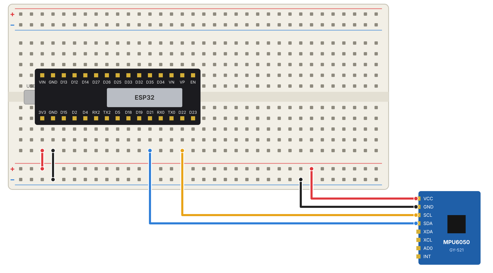
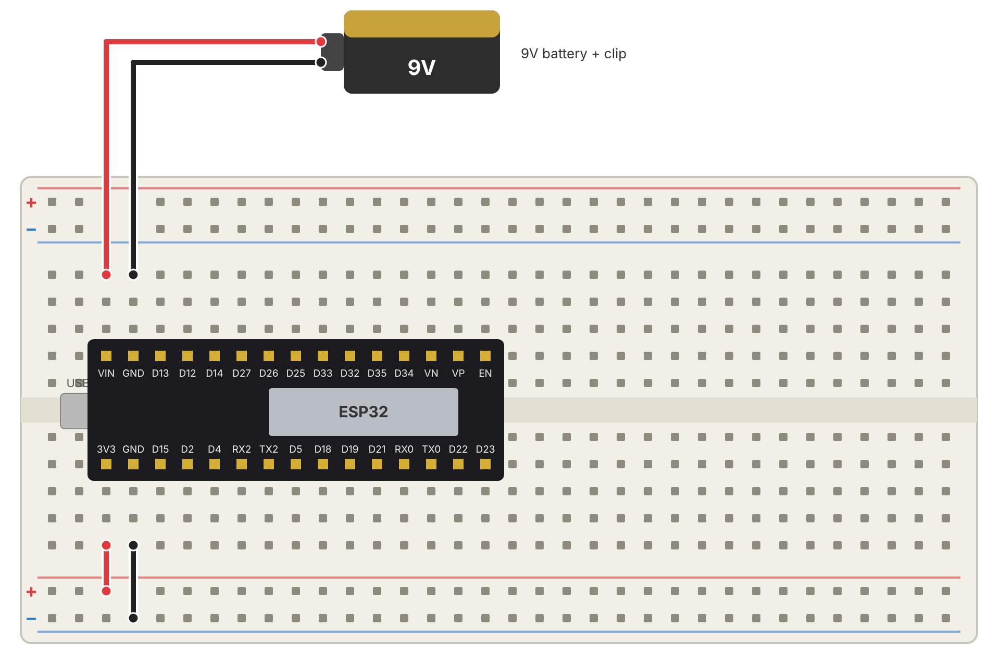

# Motion Sword



A motion-controlled Minecraft sword built for StormHacks. Swing a real (foam) sword and your character attacks in Minecraft.

The sword pairs with your laptop as a **Bluetooth mouse**, so there are no Minecraft mods and nothing to install on the laptop. Every hard swing sends a left click.

| With the sword | Laptop sees | In Minecraft |
| --- | --- | --- |
| Swing hard | Left click | Attack |

## What you need

- ESP32 dev board (30-pin, USB-C, CP2102)
- MPU6050 (GY-521) accelerometer/gyro
- Breadboard and jumper wires (male-to-male and female-to-male)
- 9V battery + clip (into **VIN**), or a USB power bank
- Something sword-shaped to mount it on. Ours is cut from black, teal and brown craft foam and held together with duct tape.
- Optional: a joystick module (used in the first version, see [the build process](#the-build-process))

## Quick start

1. **Install the ESP32 boards in the Arduino IDE.** Go to *Settings*, add `https://espressif.github.io/arduino-esp32/package_esp32_index.json` to *Additional boards manager URLs*, then install **esp32 by Espressif Systems** in the Boards Manager.
2. **Install the Bluetooth mouse library.** Download the ZIP from [T-vK/ESP32-BLE-Mouse](https://github.com/T-vK/ESP32-BLE-Mouse), then use *Sketch > Include Library > Add .ZIP Library*.
3. **Wire it up** using the table below.
4. **Upload.** Open `sword_wireless/sword_wireless.ino`, select **ESP32 Dev Module** and your USB port, and click Upload.
5. **Pair.** On your laptop, open the Bluetooth settings and connect to **Minecraft Sword**.
6. **Play.** Open Minecraft, hold a sword, and swing.

Open the Serial Monitor at **115200 baud** to see `SWING DETECTED!` every time a swing registers.

## Wiring

| From | To |
| --- | --- |
| ESP32 3V3 | + rail |
| ESP32 GND | − rail |
| MPU6050 VCC / GND | + rail / − rail |
| MPU6050 SDA | D21 |
| MPU6050 SCL | D22 |
| 9V battery red / black | VIN / GND (never 3V3 or the + rail) |

## the build process

we didn't get this working on the first try. here's how the sword was put together, including what didn't work, so you can skip our mistakes.

### step 1: plan the pins

we started by deciding which ESP32 pins to use. D21 and D22 are the ESP32's default I2C pins, which the motion sensor uses. D32, D34 and D35 were set aside for the joystick, because D34 and D35 are input-only pins that can read analog values.



### step 2: power rails

two short jumpers connect the ESP32's **3V3** and **GND** to the breadboard's + and − rails. everything else gets power from these rails.



### step 3: add the motion sensor

the MPU6050 gets power from the rails, with SDA going to D21 and SCL to D22. before writing any game code, we uploaded a small test sketch and watched the readings in the arduino **serial plotter**. when the sensor is still, the total acceleration sits around 9.8 (gravity), and when you swing it spikes well above that. that spike is the "swing".



### step 4: first version, with wi-fi, a joystick, and a laptop script

the first full version did a lot:

- **swing** to attack, **hold the sword sideways** to block with a shield, the **joystick** to walk with W/A/S/D, and **click the joystick** to jump.
- the ESP32 sent text messages over wi-fi (through a phone hotspot) to `bridge/sword_bridge.py`, a python script on the laptop that pressed the keys and mouse buttons.
- it used the adafruit MPU6050 library to read the sensor.


### step 5: the sensor wouldn't show up

this is where we got stuck. the adafruit library kept reporting that it **couldn't find the MPU6050**, even with correct wiring. many cheap GY-521 boards use a clone or similar chip that reports a different ID than the library expects, and the library refuses to talk to it.

the fix was to **skip the library** and talk to the sensor directly over I2C. we wake it up by writing to its power register, then read the raw acceleration numbers ourselves. it only takes a few lines, and it works with clone boards.

### step 6: simplify to a bluetooth mouse

with the clock running out, we cut the project down to what mattered most: **swing to attack**. instead of wi-fi plus a python script, the ESP32 now acts as a bluetooth mouse. that means:

- no hotspot and no laptop script, just pair it like any mouse.
- fewer things to break during a demo.

the joystick, blocking and the wi-fi bridge aren't in the current sketch. the python bridge is still in `bridge/`, and the full wi-fi firmware is in the git history if you want to bring them back:

```bash
git show 33a2488:sword_wireless/sword_wireless.ino
```

### step 7: go wireless with a battery

to swing without a USB cable, a 9V battery clip goes into **VIN** and **GND**. VIN runs through the board's voltage regulator, so it's safe for 9V. **never** connect the battery to 3V3 or the + rail, or you'll fry the sensor and the board.



finally, we taped the breadboard and sensor to the foam sword so the sensor moves with the blade.

## Tuning and troubleshooting

| Problem | Try this |
| --- | --- |
| Have to swing really hard | Lower `swingThreshold` in `sword_wireless.ino` (for example to `12000`) |
| Clicks when you're not swinging | Raise `swingThreshold`, or turn the sensor so its X axis isn't pointing straight down (gravity alone reads about 16384 on that axis) |
| One swing gives several hits | Increase the `delay(300)` cooldown after a click |
| "Minecraft Sword" doesn't show up in Bluetooth | Press the ESP32's EN/reset button, and remove any old pairing of the sword from your laptop |
| Nothing happens even though it's paired | Open the Serial Monitor at 115200 baud and check the MPU6050 wiring (SDA → D21, SCL → D22) |
| Library won't compile | The BLE Mouse library can have trouble with the newest ESP32 board package. Try installing esp32 version 2.0.x in the Boards Manager |

## Files

| Path | What it is |
| --- | --- |
| `sword_wireless/sword_wireless.ino` | The sword firmware: reads the MPU6050 and sends a Bluetooth left click on each swing |
| `bridge/sword_bridge.py` | Laptop script from the first, Wi-Fi version (swing, block, joystick). Not needed for the Bluetooth version |
| `images/` | Photo of the build and wiring diagrams for each step |
