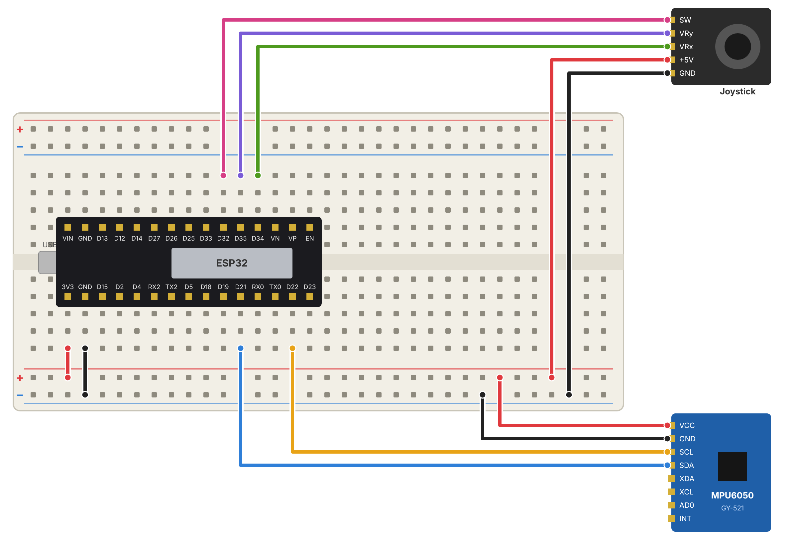

# Motion Sword

A motion-controlled Minecraft sword built for StormHacks. Swing a real (foam) sword and your character attacks in Minecraft. Hold it sideways to block, and use the thumb joystick on the handle to walk and jump.

No Minecraft mods: the sword sends its moves over Wi-Fi to a small Python script on the laptop, which presses the mouse and keyboard for you.

| With the sword | Laptop presses | In Minecraft |
| --- | --- | --- |
| Swing hard | Left click | Attack |
| Hold sideways and still | Hold right click | Shield (offhand) blocks |
| Push the joystick | W / A / S / D | Walk |
| Press the joystick down | Space | Jump |



## Hardware

- ESP32 dev board (30-pin, USB-C, CP2102)
- MPU6050 (GY-521) accelerometer/gyro
- Joystick module
- Breadboard and jumper wires (male-to-male and female-to-male)
- 9V battery + clip (into **VIN**), or a USB power bank

## Wiring

| From | To |
| --- | --- |
| ESP32 3V3 | + rail |
| ESP32 GND | − rail |
| MPU6050 VCC / GND | + rail / − rail |
| MPU6050 SDA | D21 |
| MPU6050 SCL | D22 |
| Joystick +5V / GND | + rail (3.3V) / − rail |
| Joystick VRx | D34 |
| Joystick VRy | D35 |
| Joystick SW | D32 |
| 9V battery red / black | VIN / GND (never 3V3 or the + rail) |

## Files

| Path | What it is |
| --- | --- |
| `sword_test/sword_test.ino` | Prints motion sensor readings, for checking the wiring in the Serial Plotter |
| `sword_wireless/sword_wireless.ino` | The full sword firmware: swing, block, joystick, Wi-Fi |
| `bridge/sword_bridge.py` | Laptop script that turns the sword's messages into mouse clicks and key presses |
| `images/` | Wiring diagrams for each build step |

## Setup

**ESP32 (Arduino IDE)**

1. Add `https://espressif.github.io/arduino-esp32/package_esp32_index.json` to *Additional boards manager URLs*, then install **esp32 by Espressif Systems** in the Boards Manager.
2. Install the **Adafruit MPU6050** library.
3. Select **ESP32 Dev Module** and your USB port.
4. In `sword_wireless.ino`, set `WIFI_NAME` and `WIFI_PASS` to your phone hotspot (2.4 GHz), then upload.

**Laptop**

```bash
cd bridge
pip install -r requirements.txt

# over USB (for testing)
python3 sword_bridge.py /dev/cu.usbserial-0001   # Mac
python sword_bridge.py COM3                      # Windows

# over Wi-Fi (laptop on the same hotspot)
python3 sword_bridge.py wifi
```

Then click into the Minecraft window, with a sword in your main hand and a shield in your offhand.

## How it works

The ESP32 reads the MPU6050 and joystick about 100 times a second. A spike in total acceleration above `SWING_THRESHOLD` counts as a swing. Holding the sword still with gravity on one axis counts as a block. It sends `SWING <n>` events and a `STATE <fb> <lr> <guard> <jump>` message 10 times a second over USB serial and as a UDP broadcast on port 4210. The bridge applies each state, ignores duplicate swings, and releases every key if the sword goes quiet for 1 second.

Tuning values (swing strength, block pose axis, joystick deadzone and direction) are at the top of `sword_wireless.ino`.
